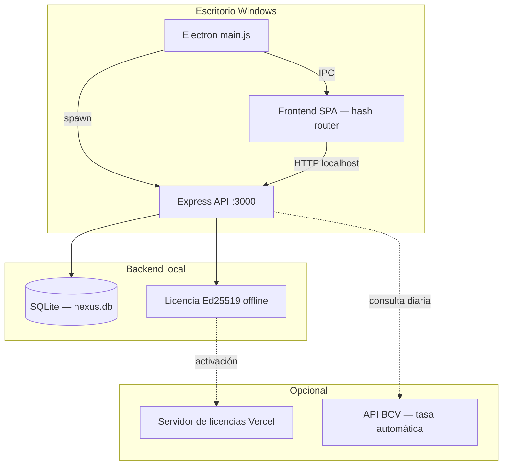

<p align="center">
  
</p>

<h1 align="center">Nexus Core</h1>

<p align="center">
  <strong>ERP y punto de venta de escritorio para comercios en Venezuela</strong><br>
  Inventario, ventas, caja, cartera, reportes y multimoneda BCV — en una sola aplicación Windows.
</p>

<p align="center">
  
  
  
  
  
</p>

---

## ¿Qué es Nexus Core?

Nexus Core es un sistema **ERP + POS** diseñado para el contexto venezolano: maneja tasas BCV, operación en bolívares y dólares de referencia, integración con **Cashea**, crédito a clientes, arqueos de caja y respaldos automáticos. Corre como aplicación de escritorio en Windows (7+) con backend Express embebido y base de datos **SQLite** local (better-sqlite3), sin necesidad de instalar ni configurar un servidor de base de datos.

Pensado para tiendas, ferreterías, abastos y negocios que necesitan **control financiero real** — no un dashboard genérico — con trazabilidad de ventas, permisos por rol y cálculos de precio consistentes entre inventario y caja. Al ser SQLite embebido, funciona bien en **equipos de bajo rendimiento** (desde 2 GB de RAM).

---

## Módulos

| Módulo | Descripción |
|--------|-------------|
| **Dashboard** | KPIs de ventas, gráficos y métricas en referencia **$ BCV** |
| **Punto de venta (POS)** | Cobro multimétodo, escáner de códigos de barras, descuentos y Cashea |
| **Caja** | Apertura, arqueo y cierre con control de sesión |
| **Inventario** | Productos, stock, costos y precios con cadena BCV/USD |
| **Ventas** | Historial, detalle, anulaciones y devoluciones |
| **Clientes** | Ficha, crédito y límites de descuento |
| **Cartera** | Cuentas por cobrar y abonos |
| **Cashea** | Cuotas, comisiones y niveles de financiamiento |
| **Compras** | Órdenes y recepción de mercancía |
| **Proveedores** | Catálogo de proveedores |
| **Reportes** | Exportación PDF/Excel y análisis operativo |
| **Configuración** | Empresa, tasas, impresoras, respaldos y modo de moneda |
| **Usuarios** | Roles, permisos granulares y auditoría |

---

## Características destacadas

### Finanzas y tasas
- **Tasa BCV** con historial en base de datos y actualización automática opcional (API privada, aplicación a medianoche Caracas según fecha valor).
- Modo **multimoneda** (tasa BCV + tasa USD operativa) o **solo BCV** (una sola tasa unificada).
- Cadena de precios sincronizada entre backend y frontend (`preciosService` ↔ `preciosClient`).
- Montos del dashboard y reportes en **referencia $ BCV**, alineados con la normativa operativa del negocio.

### Operación diaria
- POS con múltiples métodos de pago (efectivo Bs/USD, transferencia, pago móvil, Cashea, crédito).
- Control de **caja abierta** antes de vender; idempotencia en ventas para evitar duplicados.
- Impresión térmica de tickets y generación de facturas/notas en PDF.
- Respaldos automáticos de la BD SQLite (al cerrar caja, al salir o por intervalo configurable).

### Seguridad y licenciamiento
- Autenticación JWT con permisos por rol y overrides por usuario.
- Licencias **Ed25519** con activación offline vinculada al hardware (HWID).
- Validación de secretos al arranque en producción; logs estructurados con Winston.

### Primera ejecución
- Asistente de configuración: licencia → administrador → moneda → datos de empresa.
- El schema de la base de datos se crea y actualiza automáticamente al iniciar (migraciones idempotentes en `backend/config/migrations.sqlite.js`).

---

## Requisitos del sistema

| Componente | Versión mínima |
|------------|----------------|
| Windows | 7 SP1 o superior (32/64 bits) |
| Node.js | 18+ (solo para desarrollo/compilación) |
| npm | 8+ |
| RAM | 2 GB (4 GB recomendado) |
| Disco | ~400 MB (app) + espacio para BD y respaldos |

> No se requiere instalar ningún servidor de base de datos: Nexus Core usa **SQLite embebido** (better-sqlite3). El archivo `nexus.db` se crea automáticamente en el directorio de datos del usuario.

---

## Inicio rápido (desarrollo)

### 1. Clonar e instalar

```bash
git clone https://github.com/TU_USUARIO/nexuscore.git
cd nexuscore
npm install
```

> `npm install` compila automáticamente el módulo nativo `better-sqlite3` para la
> versión de Electron mediante `electron-builder install-app-deps` (postinstall).

### 2. Configurar entorno

```bash
copy .env.example .env
```

Edita `.env` con al menos un `JWT_SECRET` seguro:

```env
JWT_SECRET=<genera uno de 48+ bytes hex>
PORT=3000
NODE_ENV=development
```

Generar un `JWT_SECRET` seguro:

```bash
node -e "console.log(require('crypto').randomBytes(48).toString('hex'))"
```

### 3. Base de datos

No hay que crear ninguna base de datos manualmente. Al arrancar, Nexus Core crea el archivo `nexus.db` y aplica el schema + seed inicial automáticamente. Directorio por defecto:

- **Electron:** `userData/NexusCore_data/nexus.db`
- **Backend suelto:** `%APPDATA%\NexusCore_data\nexus.db`

Puedes forzar otra carpeta con la variable `NEXUS_SQLITE_DIR`.

### 4. Ejecutar

```bash
# Aplicación completa (Electron + backend embebido)
npm start

# Solo backend (depuración API)
npm run backend
```

La primera vez se abrirá el **asistente de configuración** (`setup.html`) para activar la licencia y registrar el administrador, la moneda y los datos de empresa.

---

## Compilar instalador Windows

```bash
# Generar iconos desde el logo oficial
npm run icons

# Instalador NSIS + versión portable → carpeta dist/
npm run dist

# Solo instalador NSIS
npm run dist:nsis

# Solo portable (sin instalador)
npm run dist:portable
```

El empaquetado incluye el schema SQLite (en el código), branding e iconos, y recompila `better-sqlite3` para el runtime de Electron. Ver [`build-resources/README.md`](build-resources/README.md) para detalles del instalador y firma de código.

---

## Arquitectura



| Capa | Tecnología |
|------|------------|
| Escritorio | Electron 22 |
| UI | HTML/CSS/JS vanilla (SPA por hash) |
| API | Express 4 |
| Base de datos | SQLite (better-sqlite3, modo WAL) |
| PDF / reportes | jsPDF, ExcelJS |
| Impresión | node-thermal-printer |
| Escáner | QuaggaJS + JsBarcode |

---

## Estructura del proyecto

```
nexuscore/
├── electron/           # Proceso principal Electron, IPC, setup, respaldos
├── frontend/           # SPA: páginas, componentes, estilos, servicios cliente
├── backend/            # API Express: controladores, servicios, middleware
│   └── config/
│       ├── database.sqlite.js    # Conexión SQLite (better-sqlite3) + wrappers
│       └── migrations.sqlite.js  # Schema consolidado + seed (runMigrations)
├── resources/templates/  # Plantillas HTML para facturas y notas
├── license-server/     # Servidor de activación Ed25519 (despliegue Vercel)
├── build-resources/    # Iconos e instalador NSIS
├── scripts/            # Utilidades de build, iconos y reset de BD
└── docs/               # Documentación técnica interna
```

---

## Variables de entorno

Referencia completa en [`.env.example`](.env.example). Variables principales:

| Variable | Propósito |
|----------|-----------|
| `JWT_SECRET` | Firma de tokens de sesión (obligatorio en producción) |
| `JWT_EXPIRES_IN` | Vida del access token (default `12h`) |
| `PORT` | Puerto del API local (default `3000`) |
| `NODE_ENV` | `development` \| `production` |
| `NEXUS_SQLITE_DIR` | Carpeta de `nexus.db` (opcional; útil para pruebas) |
| `NEXUS_BACKUP_DIR` | Carpeta de respaldos (Electron la define en `userData/backups`) |
| `NEXUS_BACKUP_INTERVAL_MINUTES` | Intervalo de respaldo automático (0 = desactivado) |
| `NEXUS_TASA_BCV_AUTO` | Activar sincronización automática de tasa BCV |
| `NEXUS_BCV_API_KEY` | Clave de la API BCV (tasa con fecha valor + feriados) |
| `NEXUS_LICENSE_PUBLIC_KEY` | Clave pública Ed25519 para verificar licencias |
| `NEXUS_FORCE_SETUP` | Forzar asistente de primera ejecución |

> **Importante:** el archivo `.env` nunca debe subirse al repositorio. En producción empaquetada, la configuración se guarda en `userData/config.env`.

---

## Scripts npm

| Comando | Acción |
|---------|--------|
| `npm start` | Inicia Electron con backend embebido |
| `npm run backend` | Solo servidor Express |
| `npm run icons` | Genera `icon.ico` / `icon.png` desde el logo |
| `npm run dist` | Build NSIS + portable |
| `npm run pack` | Build sin empaquetar (carpeta `dist/win-unpacked`) |
| `npm run db:reset` | Elimina la BD SQLite local (destructivo); se recrea al arrancar |

---

## Servidor de licencias

El directorio [`license-server/`](license-server/) contiene el microservicio de activación desplegable en Vercel. Genera claves firmadas con Ed25519 que Nexus Core valida **offline** en cada equipo.

```bash
cd license-server
npm install
# Configurar variables según license-server/.env.example
```

---

## Seguridad

- En `NODE_ENV=production`, el servidor **aborta** si `JWT_SECRET` está vacío o usa el valor de desarrollo por defecto.
- Las respuestas de error en producción no exponen stack traces ni estructura interna de la BD.
- Los tokens, contraseñas y HWIDs completos no se registran en logs.
- Toda escritura crítica (ventas, inventario, caja, cartera) se ejecuta dentro de transacciones atómicas de SQLite (`transaction()`).

---

## Desarrollo

### Convenciones del código

- Backend: `async/await`, `asyncHandler` en rutas, logging con Winston (sin `console.log` en producción).
- Utilidades duales sincronizadas entre `backend/utils/` y `frontend/services/` (teléfono VE, precios, validadores).
- Todo el schema vive en `backend/config/migrations.sqlite.js`, aplicado de forma idempotente por `runMigrations()` con tabla de control `_migrations`.
- Identidad visual: acento ámbar `#f0a500`, tipografía Sora/Barlow/DM Mono, sin estética neon/cyan.

### Reset de base de datos (solo desarrollo)

```bash
npm run db:reset -- --confirm
```

---

## Licencia

Este repositorio es **software propietario** (`"private": true`). El código fuente, la marca Nexus Core y el sistema de licencias Ed25519 están protegidos. No está autorizada la redistribución, modificación ni uso comercial sin licencia válida.

Para activación comercial o soporte, contacta al titular del proyecto.

---

<p align="center">
  <sub>Nexus Core · ERP · POS · Hecho para el comercio venezolano</sub>
</p>
