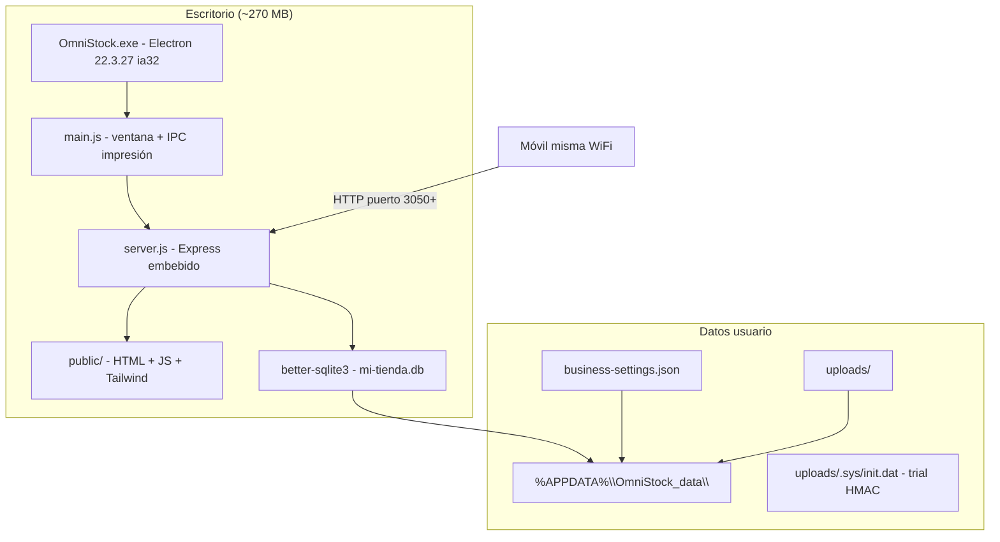
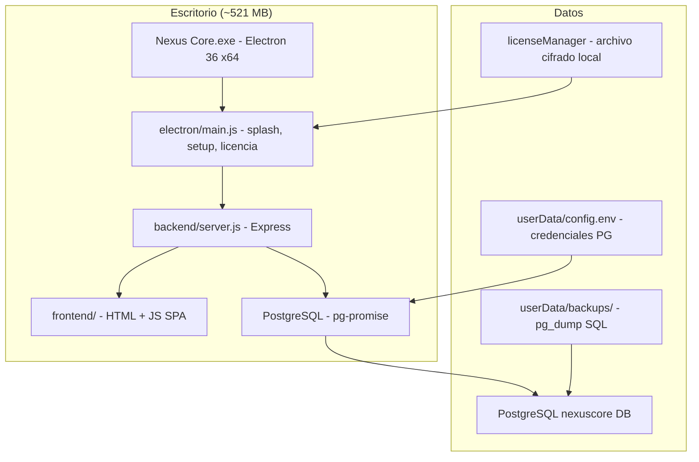

# Contexto completo para IA — OmniStock vs Nexus Core, portabilidad y stack

> **Propósito de este documento:** Entregar a una IA (o desarrollador) **todo el contexto** acumulado en una conversación de análisis entre el usuario y el asistente. Cubre objetivos del usuario, arquitectura real de ambos programas, seguridad, requisitos de hardware (incl. laptops Canaima venezolanas), opciones estratégicas y recomendaciones técnicas.
>
> **Proyecto del usuario:** `D:\nexuscore` — **Nexus Core** (ERP/POS para comercios en Venezuela).
>
> **Programa de referencia analizado:** **OmniStock** (antes **BodegApp**), de **Codigo Creativo**, instalado en `C:\Program Files (x86)\OmniStock`.
>
> **Fecha de análisis:** Junio 2026.

---

## Índice

1. [Objetivos y requisitos del usuario](#1-objetivos-y-requisitos-del-usuario)
2. [Resumen ejecutivo](#2-resumen-ejecutivo)
3. [OmniStock — stack exacto](#3-omnistock--stack-exacto)
4. [OmniStock — arquitectura y flujo](#4-omnistock--arquitectura-y-flujo)
5. [OmniStock — datos, rutas y portabilidad](#5-omnistock--datos-rutas-y-portabilidad)
6. [OmniStock — seguridad (análisis profundo)](#6-omnistock--seguridad-análisis-profundo)
7. [OmniStock — marketing vs realidad](#7-omnistock--marketing-vs-realidad)
8. [Nexus Core — stack exacto (estado actual)](#8-nexus-core--stack-exacto-estado-actual)
9. [Nexus Core — arquitectura y flujo](#9-nexus-core--arquitectura-y-flujo)
10. [Comparación directa OmniStock vs Nexus Core](#10-comparación-directa-omnistock-vs-nexus-core)
11. [Electron obsoleto vs build 32-bit (aclaración)](#11-electron-obsoleto-vs-build-32-bit-aclaración)
12. [Laptops Canaima (Venezuela)](#12-laptops-canaima-venezuela)
13. [Opciones estratégicas discutidas](#13-opciones-estratégicas-discutidas)
14. [Migración PostgreSQL → SQLite (un solo programa)](#14-migración-postgresql--sqlite-un-solo-programa)
15. [Qué copiar y qué NO copiar de OmniStock](#15-qué-copiar-y-qué-no-copiar-de-omnistock)
16. [Recomendación consolidada](#16-recomendación-consolidada)
17. [Rutas, archivos y referencias clave](#17-rutas-archivos-y-referencias-clave)
18. [Glosario](#18-glosario)

---

## 1. Objetivos y requisitos del usuario

El usuario está desarrollando **Nexus Core**, un sistema de facturación / ERP / POS para Venezuela. Le gusta OmniStock porque es:

- **Liviano** (~270 MB instalados vs ~520 MB de Nexus empaquetado).
- **Portable** (datos locales, funciona offline, fácil de copiar).
- **Instalable en muchos Windows**, incluyendo equipos viejos.

### Lo que el usuario quiere lograr

| Objetivo | Detalle |
|----------|---------|
| **Un solo programa** | No quiere mantener dos productos separados (Pro/Lite). Prefiere **un Nexus unificado**. |
| **Liviano** | Instalador pequeño, poco RAM, poco disco. |
| **Correr en cualquier PC** | Incluyendo laptops **Canaima** del gobierno venezolano. |
| **Offline-first** | Operación sin internet obligatorio (como OmniStock). |
| **Seguro** | Le importa la seguridad; preguntó si OmniStock es seguro con su configuración actual. |
| **Entender el stack** | Quiere saber exactamente cómo está armado OmniStock para replicar lo bueno en Nexus. |

### Lo que el usuario NO quiere (explícito o implícito)

- Mantener **dos codebases** o dos instaladores distintos si puede evitarlo.
- Marketing engañoso sobre requisitos (300 MB, .NET Framework, etc.).
- Copiar los **fallos de seguridad** de OmniStock (API sin auth, servidor en `0.0.0.0`).

---

## 2. Resumen ejecutivo

| | OmniStock | Nexus Core (actual) |
|---|-----------|---------------------|
| **Modelo** | Electron + Express + SQLite + HTML/JS | Electron + Express + PostgreSQL + HTML/JS |
| **Peso** | ~270 MB | ~521 MB (+ ~135 MB Postgres embebido en repo) |
| **BD** | SQLite (`mi-tienda.db`) | PostgreSQL (`pg-promise`) |
| **Electron** | 22.3.27 (obsoleto, último con Win 7) | 36.9.5 (moderno, Win 10+) |
| **Arquitectura build** | ia32 (32-bit) | x64 |
| **Seguridad API** | Parcial / inconsistente | JWT en todo `/api` protegido |
| **Red** | `0.0.0.0` (expuesto en LAN) | `127.0.0.1` (solo local) |
| **Canaima 1 GB** | Muy difícil | No viable (PG + Electron 36) |
| **Canaima 2 GB Win 7** | Posible (Electron 22 + SQLite) | No con stack actual |

**Conclusión para la IA:** El usuario busca **un solo Nexus Core** con el patrón liviano de OmniStock (SQLite, offline, portable) pero **conservando la seguridad y funcionalidad ERP** que ya tiene Nexus. La migración a SQLite es el cambio estructural principal; Electron 22 + ia32 es el cambio de compatibilidad con hardware venezolano humilde.

---

## 3. OmniStock — stack exacto

> Fuente: extracción de `app.asar` desde `C:\Program Files (x86)\OmniStock\app-1.26.10530\resources\app.asar`, `.installinfo.json`, y análisis de binarios en disco.

### Metadatos de instalación

```json
{
  "manufacturer": "Codigo Creativo",
  "appName": "OmniStock",
  "productCode": "69C04961-73CC-4E33-9105-E2589EA9278F",
  "arch": "x86",
  "installVersion": "1.26.10530"
}
```

- **Nombre comercial actual:** OmniStock
- **Nombre interno / legacy:** BodegApp (visible en `forge.config.js`, `package.json` scripts, URLs `bodegapp.com.ve`)
- **Descripción:** "Sistema de gestión para emprendimientos y bodegas en Venezuela"
- **Versión Chromium/Electron:** `22.3.27` (archivo `version` dentro de la app)

### Capas tecnológicas

| Capa | Tecnología | Versión / detalle |
|------|------------|-------------------|
| Shell desktop | **Electron** | 22.3.27 |
| Runtime | Node.js embebido en Electron | — |
| Backend embebido | **Express** | ^4.19.2 |
| Base de datos | **SQLite** vía `better-sqlite3` | ^8.5.0 |
| Frontend | **HTML + JavaScript vanilla** | Sin React/Vue en UI principal |
| Estilos | **Tailwind CSS** | ^3.4.3, compilado a `public/css/output.css` |
| Autenticación | **JWT** + **bcryptjs** | Roles: `admin`, `vendedor`; permisos granulares |
| Impresión | `@thesusheer/electron-printer` | Tickets RAW + HTML silencioso |
| PDF | PDFKit | ^0.15.0 |
| Excel/CSV | `xlsx`, `fast-csv`, `csv-parser` | Import/export |
| Licencias | RSA-SHA256 + `node-machine-id` | Trial 72 h; activación online/offline |
| Empaquetado | **Electron Forge** | Squirrel, WiX, ZIP, deb, rpm |
| Instalador Windows | Inno Setup (inferido por `unins000.exe`) | — |
| Puerto API | Dinámico desde **3050** | `portfinder` (3050–65000) |
| Red externa | axios, https | Tasas BCV, respaldo cloud en `bodegapp.com.ve` |

### Dependencias principales (`package.json` dentro del asar)

```json
{
  "name": "omnistock",
  "productName": "OmniStock",
  "version": "1.26.10530",
  "main": "main.js",
  "dependencies": {
    "@thesusheer/electron-printer": "^2.0.4",
    "axios": "^1.13.2",
    "bcryptjs": "^3.0.3",
    "better-sqlite3": "^8.5.0",
    "consulta-dolar-venezuela": "^1.1.2",
    "express": "^4.19.2",
    "jsonwebtoken": "^9.0.3",
    "multer": "^1.4.5-lts.1",
    "node-machine-id": "^1.1.12",
    "pdfkit": "^0.15.0",
    "portfinder": "^1.0.38",
    "qrcode": "^1.5.3",
    "xlsx": "^0.18.5"
  },
  "devDependencies": {
    "electron": "22.3.27",
    "@electron-forge/cli": "^7.4.0",
    "tailwindcss": "^3.4.3"
  }
}
```

### Estructura de directorios (app empaquetada)

```
C:\Program Files (x86)\OmniStock\
├── OmniStock.exe              # Launcher (~295 KB, 32-bit)
├── unins000.exe               # Desinstalador Inno Setup
├── .installinfo.json
└── app-1.26.10530\
    ├── OmniStock.exe          # Binario Electron principal (~130 MB, 32-bit)
    ├── resources\
    │   └── app.asar           # Código fuente empaquetado (~65 MB)
    ├── locales\               # Paquetes i18n Chromium
    └── [DLLs Chromium estándar]
```

### Estructura lógica del código (dentro de `app.asar`)

```
/
├── main.js                 # Proceso principal Electron
├── server.js               # Express embebido
├── preload.js              # Puente IPC seguro
├── forge.config.js         # Config Electron Forge (nombre legacy BodegApp)
├── package.json
├── controllers/            # auth, sales, products, purchases, reports, etc.
├── routes/
├── src/
│   ├── database.js         # better-sqlite3 + initializeDB + migraciones inline
│   ├── middleware/auth.middleware.js
│   └── utils/
│       ├── settings.js     # Rutas AppData, business-settings.json
│       ├── jwtSecret.js
│       ├── license.js
│       └── cloudBackup.js
├── public/                 # HTML, JS, CSS (UI completa)
│   ├── pos.html
│   ├── login.html
│   ├── configuracion.html
│   └── js/auth-guard.js    # Protección SOLO en frontend
└── node_modules/
```

### Módulos funcionales (OmniStock)

- POS / ventas multimoneda (VES, USD BCV, paralelo, COP)
- Inventario, categorías, presentaciones, seriales
- Clientes, fiados, abonos, cobranza
- Compras, gastos, proveedores
- Cashea (cuotas, liquidación)
- Cotizaciones PDF
- Reportes, cierre Z
- Import/export Excel/CSV
- Acceso móvil vía QR en LAN
- Respaldo cloud opcional (`bodegapp.com.ve/respaldo`)
- Licenciamiento offline RSA + trial 72 h

---

## 4. OmniStock — arquitectura y flujo



### Arranque (`main.js`)

1. Electron arranca con flags de GPU/sandbox:
   - `disable-gpu-sandbox`
   - `no-sandbox` ← **debilita aislamiento Chromium**
2. `portfinder` busca puerto libre desde 3050.
3. `server.js` inicia Express.
4. `BrowserWindow` carga `http://localhost:{puerto}`.
5. IPC para impresión térmica (`@thesusheer/electron-printer`).

### Servidor Express (`server.js`)

- Escucha en **`0.0.0.0`** (todas las interfaces) — habilita acceso móvil por QR pero expone LAN.
- Sirve `public/` estático.
- API REST bajo `/api/*`.
- Ruta especial `/api/print/remote` para impresión desde móviles.

### WebPreferences Electron

```javascript
webPreferences: {
  preload: path.join(__dirname, 'preload.js'),
  contextIsolation: true,
  nodeIntegration: false
}
```

Lo positivo: `contextIsolation: true`, `nodeIntegration: false`.
Lo negativo: `no-sandbox` a nivel de app.

---

## 5. OmniStock — datos, rutas y portabilidad

### Ubicación de datos

| Dato | Ruta |
|------|------|
| Base de datos | `%APPDATA%\OmniStock_data\mi-tienda.db` |
| Config negocio + JWT secret | `%APPDATA%\OmniStock_data\business-settings.json` |
| Uploads (logos, imágenes productos) | `%APPDATA%\OmniStock_data\uploads\` |
| Trial / licencia online cache | `%APPDATA%\OmniStock_data\uploads\.sys\init.dat` |
| Device ID fallback | `%APPDATA%\OmniStock_data\device.id` |
| Cache Electron | `%APPDATA%\OmniStock\` (GPUCache, etc.) |
| Migración legacy | Desde `%PROGRAMDATA%\OmniStock_data\` → AppData |

### Portabilidad práctica

Para “llevar” una instalación:

1. Copiar carpeta `%APPDATA%\OmniStock_data\` (contiene `.db`, config, uploads).
2. Copiar/reinstalar el ejecutable en otra PC.
3. La licencia está atada al HWID — puede requerir reactivación.

**Respaldo simple:** copiar `mi-tienda.db` + `business-settings.json` + `uploads/`.

### Tamaños medidos (instalación analizada)

| Concepto | Tamaño |
|----------|--------|
| Instalación total | ~270 MB |
| Solo carpeta Electron app | ~265 MB |
| Espacio realista recomendado (app + datos + updates) | **400–500 MB** |

---

## 6. OmniStock — seguridad (análisis profundo)

### Lo que está bien implementado

| Medida | Detalle |
|--------|---------|
| Contraseñas | bcrypt (cost 10) |
| JWT | Secreto aleatorio 64 bytes en `business-settings.json` |
| Renderer | `contextIsolation: true`, `nodeIntegration: false` |
| Rutas protegidas | `/api/products`, `/api/sales`, `/api/reports` usan `authRequired` / `adminOnly` |
| Licencias | Firma RSA-SHA256; trial con HMAC SHA256 |
| Roles | `admin` / `vendedor` con permisos JSON |

### Vulnerabilidades y debilidades críticas

#### 1. Servidor expuesto en toda la red

```javascript
// server.js
app.listen(port, '0.0.0.0', ...)
```

Cualquier dispositivo en la misma WiFi/LAN puede alcanzar el puerto de OmniStock.

#### 2. APIs sin autenticación en el servidor

La protección `auth-guard.js` es **solo frontend** (localStorage + redirect). Se bypassa llamando la API directamente.

| Ruta | Riesgo |
|------|--------|
| `/api/settings/*` | Cambiar tasas, negocio, **contraseña admin** |
| `/api/clients/*` | CRUD clientes, abonos, deudas |
| `/api/purchases/*` | Compras, gastos, proveedores |
| `/api/categories/*` | Categorías |
| `/api/locations/*` | Ubicaciones |
| `/api/license/*` | Info y activación |
| `/api/utils/local-ip` | Expone IP + QR |
| `/api/print/remote` | Imprimir sin login |
| `/api/backup/*` | Respaldo/restauración cloud |
| `/api/auth/set`, `/verify` (legacy) | Gestión contraseña sin token |

#### 3. Electron con sandbox desactivado

```javascript
app.commandLine.appendSwitch('disable-gpu-sandbox');
app.commandLine.appendSwitch('no-sandbox');
```

#### 4. Electron 22 obsoleto

- Chromium ~108 sin parches desde octubre 2023.
- CVEs del motor web no se corrigen.

#### 5. Base de datos sin cifrar

- `mi-tienda.db` es SQLite plano.
- `jwtSecret` en texto claro en JSON.

#### 6. Secretos hardcodeados

```javascript
const TRIAL_SECRET_KEY = 'bodegapp-secreto-hmac-2024-v1';
```

Visible en el asar → falsificación de trial posible.

#### 7. HTTPS con verificación desactivada

```javascript
// bcvUpdater.js
rejectUnauthorized: false
```

Riesgo MITM en redes no confiables.

#### 8. Respaldo cloud

Sube copia completa de BD a `https://bodegapp.com.ve/respaldo` (opcional, pero implica confiar en tercero).

#### 9. Artefactos de desarrollo en producción

El asar incluye: scripts debug, archivos `.lic` de prueba, carpeta `.agent/skills/`.

### Veredicto de seguridad por escenario

| Escenario | Riesgo |
|-----------|--------|
| PC única, sin WiFi compartida | Medio-bajo |
| Tienda con WiFi + acceso móvil QR | **Alto** |
| PC en red de oficina | **Alto** |
| Datos fiscales muy sensibles | Medio-alto (BD sin cifrar + Electron viejo) |

---

## 7. OmniStock — marketing vs realidad

### Requisitos anunciados (web/material comercial)

| Requisito | ¿Real? | Evidencia |
|-----------|--------|-----------|
| RAM 2 GB | Ajustado, no ideal | Electron usa 300–800 MB solo arrancando; 4 GB recomendado |
| Disco 300 MB | Optimista | Instalación = 270 MB; con datos/updates necesita 400–500 MB |
| .NET Framework 4.5 | **Falso / no aplica** | Es app Electron+Node, no .NET |
| No requiere internet | **Sí** (core offline) | Internet solo para BCV, licencia, cloud, móvil |
| Win 7 SP1 / 8.1 / 10 / 11 | **Sí** (técnicamente) | Electron 22.3.27 = último con Win 7 |
| Instalador universal 32/64 auto-detect | **Exagerado** | Instalación analizada = **100% ia32**; corre en x64 vía WOW64 |

### Compatibilidad Windows — matices

- Electron 22 = última versión con Win 7/8/8.1.
- EOL octubre 2023 — sin parches de seguridad Chromium.
- Win 7 necesita SP1 + Visual C++ Redistributable (no .NET).
- Build real: **PE i386 (32-bit)**, no binario x64 nativo.

---

## 8. Nexus Core — stack exacto (estado actual)

> Fuente: `D:\nexuscore\package.json`, `electron/main.js`, `backend/server.js`, build en `dist/`.

### Metadatos

```json
{
  "name": "nexus-core",
  "version": "1.0.0",
  "description": "Nexus Core ERP/POS — escritorio Windows (Win7+)",
  "main": "electron/main.js",
  "appId": "com.nexuscore.pos",
  "productName": "Nexus Core"
}
```

### Capas tecnológicas

| Capa | Tecnología | Versión / detalle |
|------|------------|-------------------|
| Shell desktop | **Electron** | ^36.9.5 |
| Backend embebido | **Express** | ^4.21.2 |
| Base de datos | **PostgreSQL** vía `pg-promise` | ^10.15.4 |
| Frontend | **HTML + JavaScript vanilla** | Router SPA en `frontend/router.js` |
| Estilos | CSS propio | `frontend/assets/css/` |
| Autenticación | JWT + bcryptjs | `requireAuth` en todo `/api` protegido |
| Rate limiting | express-rate-limit | Login y endpoints sensibles |
| CORS | cors restrictivo | Solo `null` (file://) y localhost |
| Logs | winston | Estructurados |
| PDF | jsPDF + jspdf-autotable + svg2pdf | — |
| Excel | exceljs | — |
| Impresión | node-thermal-printer | — |
| Licencias | Ed25519 offline + servidor Vercel | `electron/licenseManager.js` |
| Empaquetado | electron-builder | NSIS + portable, x64 |
| Puerto API | Fijo **3000** | Escucha **`127.0.0.1`** |
| Postgres embebido | `database/postgres` en extraResources | ~135 MB en repo |

### Dependencias principales

```json
{
  "dependencies": {
    "bcryptjs": "^2.4.3",
    "chart.js": "3.9.1",
    "cors": "^2.8.6",
    "express": "^4.21.2",
    "express-rate-limit": "^8.5.0",
    "jsonwebtoken": "^9.0.2",
    "jspdf": "2.5.2",
    "pg-promise": "^10.15.4",
    "node-thermal-printer": "^4.6.0",
    "winston": "^3.11.0"
  },
  "devDependencies": {
    "electron": "^36.9.5",
    "electron-builder": "^25.1.8"
  }
}
```

### Tamaños medidos

| Concepto | Tamaño |
|----------|--------|
| `dist/win-unpacked` | ~521 MB |
| Bundle `database/postgres` en repo | ~135 MB |

### Estructura del repositorio

```
D:\nexuscore\
├── electron/
│   ├── main.js              # Splash, setup PG, licencia, ventana principal
│   ├── preload.js
│   ├── licenseManager.js    # Ed25519, archivo local cifrado
│   └── setupConfig.js       # Wizard PostgreSQL
├── backend/
│   ├── server.js            # Express, auth global en /api
│   ├── config/
│   │   ├── database.js      # pg-promise pool
│   │   └── migrations.js    # Parches JS + SQL
│   ├── controllers/
│   ├── routes/
│   └── services/
├── frontend/
│   ├── index.html
│   ├── router.js
│   └── pages/               # pos, inventario, reportes, etc.
├── database/
│   └── migrations/          # 001–044 archivos .sql (PostgreSQL)
├── license-server/          # API Vercel para activación
├── dist/                    # Builds electron-builder
└── docs/                    # Documentación interna
```

### Módulos funcionales (Nexus Core)

- Dashboard KPIs (Chart.js)
- POS multimoneda (BCV, USD operativo, Cashea)
- Caja (apertura, arqueo, cierre, sesiones)
- Inventario, productos, import Excel
- Ventas, anulaciones, devoluciones
- Clientes, cartera, crédito, abonos
- Cashea (cuotas, comisiones, niveles)
- Compras, proveedores, cuentas por pagar
- Cotizaciones PDF
- Reportes PDF/Excel
- Configuración, usuarios, permisos granulares
- Respaldos `pg_dump` automáticos
- Licenciamiento profesional Ed25519 + Vercel

---

## 9. Nexus Core — arquitectura y flujo



### Arranque (`electron/main.js`)

1. Carga `config.env` (wizard primera ejecución).
2. Splash screen con progreso.
3. Si falta config → `setup.html` (PostgreSQL paso 1, licencia paso 2, admin paso 3).
4. `backend/server.js` → `initDatabaseWithRetry` (hasta 5 intentos).
5. Migraciones automáticas (001–044+).
6. Gate de licencia (`licenseManager.evaluate()` + fallback legacy PG).
7. Ventana principal → `frontend/index.html`.

### Servidor Express (`backend/server.js`)

- Escucha **`127.0.0.1:3000`** — no expuesto a LAN.
- CORS restrictivo.
- Rate limit en login.
- **`apiProtected`** con `requireAuth` en todas las rutas `/api/*` excepto auth, licencia y setup.
- Validación `JWT_SECRET` en producción (aborta si inseguro).

### Seguridad Electron

```javascript
webPreferences: {
  preload: getPreloadPath(),
  contextIsolation: true,
  nodeIntegration: false,
  sandbox: false  // ventana principal; splash usa sandbox: true
}
```

---

## 10. Comparación directa OmniStock vs Nexus Core

| Aspecto | OmniStock | Nexus Core |
|---------|-----------|------------|
| **Fabricante** | Codigo Creativo | Usuario / Nexus Core |
| **Nombre legacy** | BodegApp | — |
| **Electron** | 22.3.27 (EOL) | 36.9.5 (actual) |
| **Arquitectura CPU** | ia32 (32-bit) | x64 |
| **BD** | SQLite | PostgreSQL |
| **Tamaño install** | ~270 MB | ~521 MB |
| **Wizard instalación** | Mínimo | PostgreSQL + licencia + admin |
| **Puerto** | Dinámico 3050+ | Fijo 3000 |
| **Bind red** | 0.0.0.0 ⚠️ | 127.0.0.1 ✅ |
| **Auth API** | Parcial ⚠️ | Completa ✅ |
| **Licencias** | RSA offline + trial HMAC | Ed25519 + Vercel ✅ |
| **Respaldos** | Copiar .db / cloud | pg_dump |
| **Win 7** | Sí (Electron 22) | No (Electron 36) |
| **Canaima 2GB** | Posible | No viable actual |
| **Multi-caja red** | No diseñado para eso | PG permite más escala |
| **Complejidad ERP** | POS/bodega | ERP completo (Cashea, cartera, cuentas pagar, etc.) |

### Patrón arquitectónico compartido (lo que el usuario quiere replicar)

```
Electron → Express embebido → HTML/JS estático → BD local → Instalador Windows → Offline-first
```

**Nexus ya tiene este patrón.** La diferencia principal es **PostgreSQL vs SQLite** y **Electron 36/x64 vs Electron 22/ia32**.

---

## 11. Electron obsoleto vs build 32-bit (aclaración)

Confusión común del usuario — son conceptos distintos:

| Término | Qué es | Estado |
|---------|--------|--------|
| **Electron 22** (versión motor) | Chromium 108 embebido | **Obsoleto** — sin parches desde oct 2023; último con Win 7 |
| **Build ia32 / x86** (arquitectura .exe) | 32-bit vs 64-bit | **Válido** — no está "obsoleto"; corre en x64 vía WOW64 |
| **Electron 36** (Nexus actual) | Chromium moderno | **Actual y seguro** — requiere Win 10+ en práctica |

### Qué implica Electron 22 obsoleto

**Pierdes:**
- Parches de seguridad de Chromium.
- Soporte oficial.

**NO pierdes automáticamente:**
- Lógica de negocio, JWT, bcrypt, licencias.
- Seguridad a nivel aplicación (auth, localhost).

**Riesgo en POS offline local:** Medio-bajo si:
- Solo localhost (`127.0.0.1`)
- Auth en todas las APIs
- No navegación web externa en la app
- `contextIsolation: true`

OmniStock tiene riesgo **más alto** por `0.0.0.0` + APIs sin auth.

### Protección con tecnología actual (capas)

1. **App** — JWT, bcrypt, rate limit, CORS, auth universal (Nexus ✅)
2. **Red** — solo 127.0.0.1
3. **Datos** — respaldos; cifrado opcional del .db
4. **Licencias** — Ed25519 offline (Nexus ✅)
5. **Motor** — Electron 36 en PCs modernas; Electron 22 solo donde haga falta compatibilidad

**No se puede tener simultáneamente:** Electron 36 + Win 7 + Canaima 1GB.

---

## 12. Laptops Canaima (Venezuela)

Equipos educativos del gobierno venezolano. Specs variables por generación:

| Modelo | RAM | CPU | SO típico | ¿Nexus actual? | ¿OmniStock-like? |
|--------|-----|-----|-----------|----------------|------------------|
| Canaima 1–3 (Atom) | **1 GB** | Atom N270/N455 ~1.6 GHz | Linux / Win 7 32-bit | **No viable** | **Muy difícil** |
| Canaima 4 (Celeron 847) | **2 GB** | ~1.1 GHz | Win 7 / Linux | **No recomendable** | Posible con optimización |
| Canaima 5 (Celeron N2805) | **2–4 GB** | ~1.6 GHz | Canaima GNU/Linux / Win | Marginal | **Razonable** en Win 7+ |

### Limitaciones importantes

1. **Muchas Canaimas vienen con Linux nativo** — Nexus es solo Windows hoy.
2. **Win 10 en Canaima 1 GB** — experiencia "peor que tortuga" (reportes de usuarios).
3. **Electron solo** consume 400–700 MB RAM — en 1 GB no alcanza.
4. **PostgreSQL** añade RAM y complejidad — inviable en Canaima.

### Requisitos honestos sugeridos para Nexus unificado (objetivo Canaima)

```
RAM:      2 GB mínimo · 4 GB recomendado
Disco:    500 MB libres
SO:       Windows 7 SP1 / 8.1 / 10 / 11 (32 o 64 bits vía build ia32)
CPU:      Intel Atom/Celeron 1.6 GHz+
Internet: No requerido para operar
Notas:    Canaima 1–3 (1 GB) no soportada
          Canaima con Linux nativo: no compatible (solo Windows)
          Visual C++ Redistributable recomendado (NO .NET Framework)
```

---

## 13. Opciones estratégicas discutidas

### Opción A — Mantener Nexus actual (PostgreSQL + Electron 36 + x64)

| Pros | Contras |
|------|---------|
| Ya funciona | ~521 MB, no Canaima |
| Seguridad moderna | Wizard PG obligatorio |
| ERP completo, multi-transacción | Solo Win 10+ |
| pg_dump profesional | — |

**Para:** tiendas con PC decente (4 GB+, Win 10/11).

---

### Opción B — Dos productos (Nexus Pro + Nexus Lite) — **descartado por el usuario**

| Pro | Lite |
|-----|------|
| Electron 36 + PG + x64 | Electron 22 + SQLite + ia32 |
| PC moderna | Canaima / Win 7 |

**Usuario prefiere UN solo programa** — no quiere mantener dos.

---

### Opción C — Un solo Nexus con SQLite (recomendación alineada al usuario)

```
1 código + SQLite + Electron 22 ia32 + 1 instalador
```

| Pros | Contras |
|------|---------|
| Liviano (~200–280 MB) | Reescribir ~43 migraciones PG |
| Sin wizard PostgreSQL | SQL avanzado en reportes |
| Portable (copiar .db) | Multi-caja en red limitado |
| Canaima 2GB+ viable | Electron 22 sin parches Chromium |
| Un solo producto | 3–6 semanas migración estimada |

---

### Opción D — Un solo Nexus: SQLite + Electron 36

| Pros | Contras |
|------|---------|
| Motor moderno y seguro | **No Win 7 / Canaima vieja** |
| SQLite liviano | Sigue siendo x64 (no ia32) |

---

### Matriz de decisión

| Estrategia | # Programas | Canaima Win | Esfuerzo dev | Seguridad motor |
|------------|-------------|-------------|--------------|-----------------|
| PG + Electron 36 (actual) | 1 | Mal | Bajo | Alta |
| SQLite + Electron 36 | 1 | Regular | Medio-alto | Alta |
| **SQLite + Electron 22 ia32** | **1** | **Mejor** | **Medio-alto** | Media |
| Pro + Lite separados | 2 | Mejor cobertura | Alto | Mixta |

**Recomendación para el objetivo del usuario:** **Opción C** — un solo Nexus, SQLite, Electron 22, ia32.

---

## 14. Migración PostgreSQL → SQLite (un solo programa)

### Qué mejora

| Aspecto | PostgreSQL | SQLite |
|---------|------------|--------|
| Tamaño instalador | ~521 MB | ~200–280 MB |
| RAM | PG daemon + Electron | Solo Electron + SQLite |
| Primera ejecución | Wizard PG | Auto-crea `nexus.db` |
| Portabilidad | pg_dump/psql | Copiar un archivo |
| Respaldos | pg_dump + versiones | `.backup()` o copiar archivo |
| Canaima 2 GB | Muy justo | Mucho más viable |

### Qué hay que rehacer en Nexus (costo real)

| Componente | Estado en `D:\nexuscore` |
|------------|--------------------------|
| **43 migraciones `.sql`** | PG: SERIAL, JSONB, triggers plpgsql |
| **Backend completo** | `pg-promise`: `db.one`, `db.tx`, `$1`, `$1:name` |
| **Reportes/dashboard** | `jsonb`, `::numeric`, `LATERAL`, `FILTER` |
| **Caja/ventas** | Transacciones, `FOR UPDATE`, `RETURNING` |
| **Respaldos** | `syncService.js`, `pgDumpResolver.js` |
| **Electron setup** | Wizard PG en setup.html / setupConfig.js |

**Estimación:** 3–6 semanas de trabajo enfocado.

### Diferencias técnicas SQL

| Feature PostgreSQL | Equivalente SQLite |
|--------------------|-------------------|
| `JSONB` | `TEXT` + JSON.parse en JS, o `json_*` SQLite 3.38+ |
| `SERIAL` | `INTEGER PRIMARY KEY AUTOINCREMENT` |
| `ILIKE` | `LIKE` (case-insensitive con `COLLATE NOCASE`) |
| Triggers `plpgsql` | Triggers SQLite o **lógica en Node** (preferido, estilo OmniStock) |
| `RETURNING` | Soportado en SQLite 3.35+ |
| `ON CONFLICT` | Soportado |
| `FOR UPDATE` | Limitado — revisar flujos de caja |
| `jsonb_array_elements`, `LATERAL`, `FILTER` | Reescribir en JS o SQL SQLite |
| `pg_dump` | Copia de archivo / `.backup()` |

### Concurrencia

- **1 PC, 1 cajero (Canaima/tienda pequeña):** SQLite WAL mode = **perfecto**.
- **Varios cajeros en red contra una BD:** PostgreSQL gana; SQLite no ideal.

### Qué NO cambia con SQLite

- Electron + Express + HTML/JS (frontend intacto)
- JWT, bcrypt, permisos, rate limit
- Licencias Ed25519
- Impresión, PDF, POS, Cashea (misma lógica, otro SQL)
- Un solo repo, un solo `package.json`

### Plan de migración sugerido (fases)

1. **Capa DB abstracta** — interfaz común sobre `pg-promise` / `better-sqlite3`.
2. **Esquema SQLite inicial** — traducir `001_initial_schema.sql` + parches críticos.
3. **Módulos core** — auth, productos, POS, ventas, caja (prioridad operativa).
4. **Triggers PG → servicios Node** — stock, tasas, historial.
5. **Reportes/dashboard** — reescribir SQL PG avanzado.
6. **Respaldos** — reemplazar pg_dump por copia `.db`.
7. **Eliminar** wizard PG, `database/postgres`, extraResources PG.
8. **Build** — Electron 22 + ia32 en electron-builder.
9. **Pruebas VM** — 2 GB RAM, 1 core, Win 7 32-bit.

---

## 15. Qué copiar y qué NO copiar de OmniStock

### Copiar (patrones buenos)

- SQLite + un archivo `.db` en AppData
- Express embebido + HTML/JS (sin framework pesado)
- Puerto dinámico opcional (`portfinder`)
- Datos separados del ejecutable (`%APPDATA%\NexusCore_data\`)
- Offline-first
- Build ia32 para compatibilidad WOW64
- Respaldos = copiar archivo
- Migraciones inline en JS (estilo `database.js` de OmniStock)

### NO copiar (anti-patrones)

| OmniStock | Por qué evitarlo |
|-----------|------------------|
| `0.0.0.0` sin auth LAN | Nexus ya usa `127.0.0.1` ✅ |
| APIs sin JWT | Nexus ya tiene `apiProtected` ✅ |
| `no-sandbox` | Mantener sandbox donde sea posible |
| Electron 22 sin plan de seguridad app | Combinar con auth fuerte |
| Secretos hardcodeados (`TRIAL_SECRET_KEY`) | Derivar del HWID o env |
| `rejectUnauthorized: false` | Validar TLS |
| Marketing falso (.NET, 300 MB, 2 GB) | Ser honesto en requisitos |
| Debug/licencias de prueba en asar | Limpiar build de producción |

---

## 16. Recomendación consolidada

### Para el objetivo del usuario

> **Un solo Nexus Core**, liviano, portable, que corra en la mayoría de PCs Windows venezolanos (incl. Canaima con Win 7 y 2 GB+), offline, seguro.

### Stack objetivo recomendado

```
Electron 22.3.27 (ia32)
+ Express 4
+ better-sqlite3
+ HTML/JS frontend (sin cambios de paradigma)
+ Datos en %APPDATA%\NexusCore_data\nexus.db
+ Licencias Ed25519 (mantener licenseManager.js)
+ API en 127.0.0.1 con requireAuth universal
+ Instalador NSIS/portable único (~250 MB)
```

### Lo que implica renunciar

- Electron 36 en producción (Win 10+ nativo moderno).
- PostgreSQL y todo su ecosistema (pg_dump, wizard, pool).
- Multi-caja concurrente en red (a menos que se diseñe servidor aparte después).
- Soporte Canaima Linux nativo (requeriría build Linux separado — fase 2).

### Lo que se gana

- Un producto, un instalador, un codebase.
- Peso similar a OmniStock.
- Portabilidad real (copiar `.db`).
- Compatible con Win 7 SP1 → 11 vía ia32.
- Seguridad superior a OmniStock (auth, localhost, licencias modernas).

---

## 17. Rutas, archivos y referencias clave

### OmniStock (instalación analizada)

| Recurso | Ruta |
|---------|------|
| Instalación | `C:\Program Files (x86)\OmniStock\` |
| App Electron | `C:\Program Files (x86)\OmniStock\app-1.26.10530\` |
| Código empaquetado | `...\resources\app.asar` |
| Datos usuario | `%APPDATA%\OmniStock_data\` |
| Base de datos | `%APPDATA%\OmniStock_data\mi-tienda.db` |
| Config | `%APPDATA%\OmniStock_data\business-settings.json` |
| Web oficial (legacy) | https://www.bodegapp.com.ve |
| Respaldo cloud | https://bodegapp.com.ve/respaldo |

### Archivos críticos OmniStock (dentro de asar)

| Archivo | Función |
|---------|---------|
| `main.js` | Electron, GPU, puerto, ventana |
| `server.js` | Express, rutas, `0.0.0.0` |
| `src/database.js` | SQLite init + migraciones |
| `src/utils/settings.js` | AppData paths |
| `src/middleware/auth.middleware.js` | JWT |
| `controllers/auth.controller.js` | Login bcrypt |
| `src/utils/license.js` | RSA + trial HMAC |
| `public/js/auth-guard.js` | Guard frontend (no server) |
| `forge.config.js` | Build BodegApp/OmniStock |

### Nexus Core (repositorio)

| Recurso | Ruta |
|---------|------|
| Raíz proyecto | `D:\nexuscore\` |
| Electron main | `D:\nexuscore\electron\main.js` |
| Licencias | `D:\nexuscore\electron\licenseManager.js` |
| Backend | `D:\nexuscore\backend\server.js` |
| BD config | `D:\nexuscore\backend\config\database.js` |
| Migraciones PG | `D:\nexuscore\database\migrations\001` – `044` |
| Migraciones JS | `D:\nexuscore\backend\config\migrations.js` |
| Frontend | `D:\nexuscore\frontend\` |
| Build config | `D:\nexuscore\package.json` → `build` |
| Build output | `D:\nexuscore\dist\` |
| Respaldos | `D:\nexuscore\backend\services\syncService.js` |
| pg_dump resolver | `D:\nexuscore\backend\utils\pgDumpResolver.js` |
| Servidor licencias | `D:\nexuscore\license-server\` |
| Docs existentes | `D:\nexuscore\docs\` |

### Comandos Nexus útiles

```powershell
cd D:\nexuscore
npm start                    # Dev Electron + backend
npm run backend              # Solo API
npm run dist                 # Instalador NSIS + portable
npm run dist:portable        # Solo portable
npm run pack                 # win-unpacked sin installer
```

---

## 18. Glosario

| Término | Definición |
|---------|------------|
| **ia32 / x86** | Build de 32 bits; corre en Windows 64-bit vía WOW64 |
| **x64** | Build nativo 64 bits |
| **WOW64** | Capa Windows que ejecuta apps 32-bit en OS 64-bit |
| **Electron EOL** | Fin de soporte; sin parches de seguridad Chromium |
| **AppData** | `%APPDATA%` — datos roaming del usuario en Windows |
| **asar** | Archivo empaquetado del código Node en Electron |
| **WAL mode** | Write-Ahead Logging de SQLite; mejor concurrencia lectura/escritura |
| **HWID** | Hardware ID para licenciamiento por equipo |
| **Canaima** | Laptop educativa venezolana (varios modelos/generaciones) |
| **POS** | Point of Sale — punto de venta |
| **ERP** | Enterprise Resource Planning — gestión integral |
| **pg_dump** | Utilidad PostgreSQL de respaldo SQL |
| **JWT** | JSON Web Token para sesiones API |
| **Ed25519** | Algoritmo criptográfico moderno (licencias Nexus) |
| **RSA-SHA256** | Algoritmo licencias OmniStock |

---

## Notas finales para la IA que lea este documento

1. **El usuario NO quiere dos programas.** Cualquier propuesta debe converger en **un solo Nexus Core**.
2. **SQLite es el cambio estructural principal** para lograr peso y portabilidad tipo OmniStock.
3. **Electron 22 + ia32** es el cambio de compatibilidad para Canaima/Win 7 — es independiente de SQLite pero complementario.
4. **No sacrificar la seguridad de Nexus** imitando OmniStock (`0.0.0.0`, APIs abiertas).
5. **Canaima 1 GB y Canaima Linux** están fuera de alcance razonable con Electron; ser honesto.
6. **La migración PG→SQLite es trabajo significativo** por 44 migraciones y SQL avanzado en reportes/caja.
7. **Nexus ya supera a OmniStock** en auth, licencias y arquitectura ERP; el objetivo es **bajar peso y subir compatibilidad**, no simplificar funcionalidad.

---

*Documento generado como contexto persistente para sesiones de IA posteriores. Actualizar cuando cambie la decisión de stack o avance la migración.*
